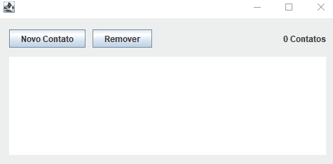
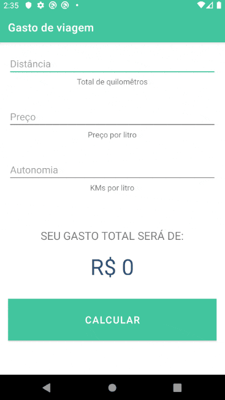
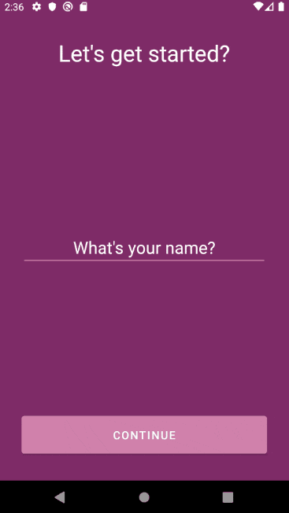
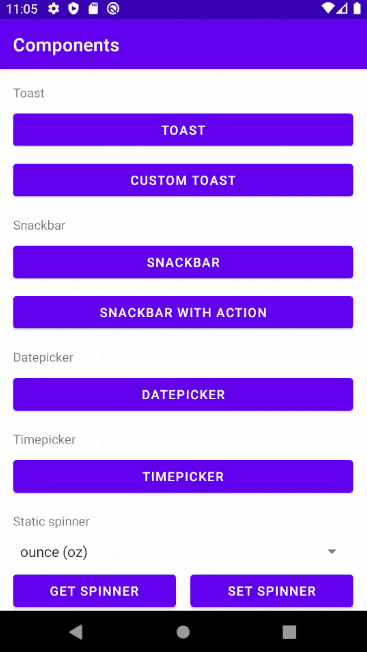

<h1 align="center">
  Udemy - Desenvolvimento de Aplicativos Android usando Kotlin
</h1>
 

  <a href="#-curso">Curso</a>&nbsp;&nbsp;&nbsp;|&nbsp;&nbsp;&nbsp;
  <a href="#-projetos">Projetos</a>&nbsp;&nbsp;&nbsp;|&nbsp;&nbsp;&nbsp;
  <a href="#%EF%B8%8F-desenvolvimento">Desenvolvimento</a>&nbsp;&nbsp;&nbsp;

 

## 📚 Curso
 
Básico da linguagem, configurações e conceitos iniciais, como executar Kotlin, como ele funciona na JVM, declaração de variáveis, funções, controle de fluxo, orientação a objetos, classes e objetos, herança, classes abstratas, interfaces e coleções. Com o conhecimento adquirido criamos desde aplicações Android simples até aplicações complexas, utilizando os conceitos mais modernos e conhecidos do mercado, como: Banco de dados, API, ConstraintLayout, etc.

## ✨ Projetos
 
- [InitialConcepts](https://github.com/gustavofariaa/AndroidKotlinUdemy/tree/main/InitialConcepts)
- [Schedule](https://github.com/gustavofariaa/AndroidKotlinUdemy/tree/main/Schedule)
  

    
  

- Layout
    - [Exercise1](https://github.com/gustavofariaa/AndroidKotlinUdemy/tree/main/ExerciseLayout1)
    - [Exercise2](https://github.com/gustavofariaa/AndroidKotlinUdemy/tree/main/ExerciseLayout2)
    - [Exercise3](https://github.com/gustavofariaa/AndroidKotlinUdemy/tree/main/ExerciseLayout3)
    - [Exercise4](https://github.com/gustavofariaa/AndroidKotlinUdemy/tree/main/ExerciseLayout4)
    - [Exercise5](https://github.com/gustavofariaa/AndroidKotlinUdemy/tree/main/ExerciseLayout5)
- [TravelExpenses](https://github.com/gustavofariaa/AndroidKotlinUdemy/tree/main/TravelExpenses)
  

    
  

- [Motivation](https://github.com/gustavofariaa/AndroidKotlinUdemy/tree/main/Motivation)
  

    
  

- [MVVM](https://github.com/gustavofariaa/AndroidKotlinUdemy/tree/main/MVVM)
  

    
  

- [Guests](https://github.com/gustavofariaa/AndroidKotlinUdemy/tree/main/Guests)
  

    
  

- [ExampleRetrofit](https://github.com/gustavofariaa/AndroidKotlinUdemy/tree/main/ExampleRetrofit)
- [Tasks](https://github.com/gustavofariaa/AndroidKotlinUdemy/tree/main/Tasks)
  

    
  

- [Components](https://github.com/gustavofariaa/AndroidKotlinUdemy/tree/main/Components)
  

    
  

 
## 🛠️ Desenvolvimento
 
- [Kotlin](https://kotlinlang.org/)
- [Android](https://developer.android.com/kotlin)
 
 
 
---
 
 
 

 

